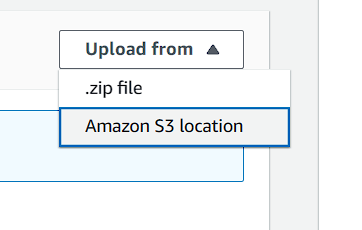

# image-lambda

----

**1. Compress these files:**
* index.js
* package-lock.json
* package.json
* node_modules 

**2. To AWS:**

* Create an S3 Bucket with "open" read permissions then upload to it the previous zip file.
* Set up the Lambda Function then upload the compressed file from s3 location.

> When an image is uploaded to your S3 bucket, it should trigger a Lambda function, which will updates image.json file automatically

----

**images.json file link:** https://testlab17.s3.amazonaws.com/images.json